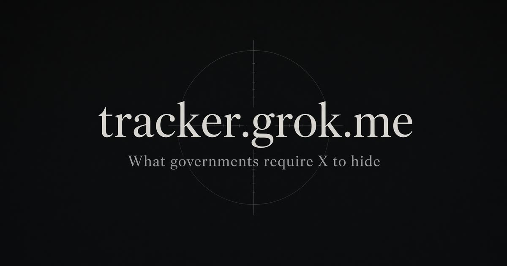

# tracker.grok.me

**See what governments require X to hide — by country.**

[Live atlas](https://gov-tracker.grok.me) · [United Kingdom](https://gov-tracker.grok.me/country/GB) · [Japan](https://gov-tracker.grok.me/country/JP) · [Canada](https://gov-tracker.grok.me/country/CA) · [Vision](docs/VISION.md) · [Feedback](docs/FEEDBACK.md)

<p align="center">
  
</p>

This is a compiled transparency atlas, not a live feed of every withheld post. X still does not publish that catalog. We publish everything that *is* public: open-source ranking filters, named court and regulator files, statutory duty lists, and the country rows from X’s own transparency reports.

A headline total does not move the needle. **Named duties, a real category split, and a live file do.**

| Country | What the official report looks like | What this atlas actually shows |
| --- | --- | --- |
| **Japan** | 69,186 removal requests | **96%** financial crime, narcotics, prostitution. Separate **情プラ法** 7-day honor/privacy track. Not a political ranking filter. |
| **United Kingdom** | Folded into “All others” | **19** illegal-content duties + **7** child-only duties from [X’s own UK page](https://help.x.com/en/rules-and-policies/uk-resources). Live Ofcom and ICO files on Grok. Category 1. |
| **Brazil** | Access restored | The only government ranking filter in the public For You code: `Brazil2026ElectionFilter` (~665 TSE-listed accounts). |
| **Canada** | No named removal row | B.C. Supreme Court petition on global vs geo-blocked intimate-image takedowns. C-63 is not law. |

Compiled **15 August 2026** from the [x-algorithm](https://github.com/xai-org/x-algorithm) repo and [X Transparency Center](https://transparency.x.com). Not an official X product.

---

## What this is

- A **country atlas** of access, legal-demand volume, named restrictions, and court/agency dockets.
- A **legal menu** where X or a regulator published the actual category list.
- An honest **gap callout** on every deep page: what is still not listed.

## What this is not

- A live index of withheld posts. Those still only appear as a notice when opened from that country.
- A claim that volume equals political censorship. Japan’s 69k is the counter-example.
- A substitute for primary sources. Every compiled row cites one.

Read [docs/VISION.md](docs/VISION.md) for the editorial bar.

---

## Feedback

The atlas is only as sharp as the public record people send us.

- **In the app:** [Report a gap](https://gov-tracker.grok.me/feedback)
- **On GitHub:** [open an issue](https://github.com/lukejmorrison/tracker/issues/new/choose)
- **The bar:** a primary source URL, or it does not land. See [docs/FEEDBACK.md](docs/FEEDBACK.md).

Four lanes: *correction*, *missing proceeding*, *named duties*, *product*.

---

## Repo map

```
src/data/           compiled atlas — countries, menus, proceedings
src/routes/         pages (atlas, country, courts, filters, sources, feedback)
src/components/     docket, legal menu, restriction list
docs/               vision, feedback framework, data guide
.github/            issue templates
```

How to add a country row or a court file: [docs/DATA.md](docs/DATA.md) and [CONTRIBUTING.md](CONTRIBUTING.md).

---

## Run it

```bash
npm install
npm run dev          # http://127.0.0.1:8080
npm run typecheck
npm run build
```

React 19 · TanStack Start · Tailwind v4.

---

## License

[MIT](LICENSE). Compilation is ours. The underlying court records, statutes, and X transparency tables remain with their publishers.
